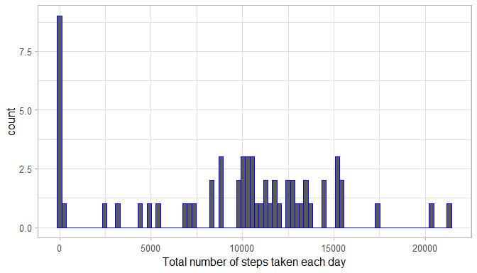
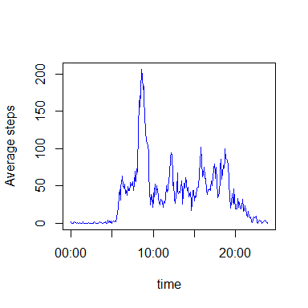
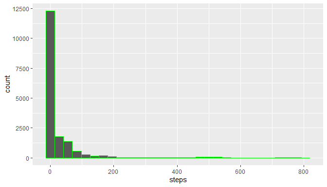
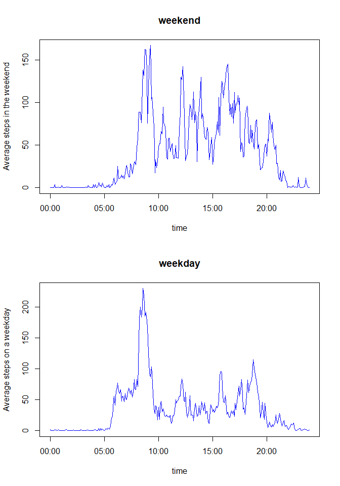

This report will answer the questions which are part of this assignment


## Loading and preprocessing the data

To load the data we must first unzip the data and create the data directory

```r
unzip("activity.zip", exdir = "data")
```

Next we can read the data


```r
directory <- getwd()
data <- read.csv(paste0(directory,"/data/activity.csv"), sep=",")
```

## What is mean total number of steps taken per day?
To create the histogram of the total number of steps taken each day we need to get this data


```r
library(dplyr)
```


```r
Sumperday <-
  data %>%
    group_by(date) %>%
      summarize(Sumeveryday = sum(steps, na.rm = TRUE))
```

The histogram of the total number of steps taken each day

<!-- -->


## What is mean total number of steps taken per day?

First we need to calculate this data

```r
MeanMedianperday <-
      data %>%
          group_by(date) %>%
             summarize(mean = mean(steps), median = median(steps)) 
```

To create a table which is well readable we need to load some libraries 

```r
library(xtable)
library(htmltools)
library(htmlTable)
```

To make the table even better we only want to show the number with only 2 digits

```r
RoundedMeanMedianperday <-
  MeanMedianperday %>%
  mutate(meanround = round(mean, digits = 2))

DatafortableRoundedmeanmedianperday <- select(RoundedMeanMedianperday, -mean)
```

The table with median and mean total number of steps taken per day

```r
xt <- xtable(DatafortableRoundedmeanmedianperday)
htmlTable(xt, ctable=c("date", "meanround", "median"), caption= "Table with mean and median numbers of steps each day")
```

<table class='gmisc_table' style='border-collapse: collapse; margin-top: 1em; margin-bottom: 1em;' >
<thead>
<tr><td colspan='4' style='text-align: left;'>
Table with mean and median numbers of steps each day</td></tr>
<tr>
<th style='border-bottom: 1px solid grey; border-top: 4px double grey;'> </th>
<th style='border-bottom: 1px solid grey; border-top: 4px double grey; text-align: center;'>date</th>
<th style='border-bottom: 1px solid grey; border-top: 4px double grey; text-align: center;'>median</th>
<th style='border-bottom: 1px solid grey; border-top: 4px double grey; text-align: center;'>meanround</th>
</tr>
</thead>
<tbody>
<tr>
<td style='text-align: left;'>1</td>
<td style='text-align: center;'>2012-10-01</td>
<td style='text-align: center;'></td>
<td style='text-align: center;'></td>
</tr>
<tr>
<td style='text-align: left;'>2</td>
<td style='text-align: center;'>2012-10-02</td>
<td style='text-align: center;'>0</td>
<td style='text-align: center;'>0.44</td>
</tr>
<tr>
<td style='text-align: left;'>3</td>
<td style='text-align: center;'>2012-10-03</td>
<td style='text-align: center;'>0</td>
<td style='text-align: center;'>39.42</td>
</tr>
<tr>
<td style='text-align: left;'>4</td>
<td style='text-align: center;'>2012-10-04</td>
<td style='text-align: center;'>0</td>
<td style='text-align: center;'>42.07</td>
</tr>
<tr>
<td style='text-align: left;'>5</td>
<td style='text-align: center;'>2012-10-05</td>
<td style='text-align: center;'>0</td>
<td style='text-align: center;'>46.16</td>
</tr>
<tr>
<td style='text-align: left;'>6</td>
<td style='text-align: center;'>2012-10-06</td>
<td style='text-align: center;'>0</td>
<td style='text-align: center;'>53.54</td>
</tr>
<tr>
<td style='text-align: left;'>7</td>
<td style='text-align: center;'>2012-10-07</td>
<td style='text-align: center;'>0</td>
<td style='text-align: center;'>38.25</td>
</tr>
<tr>
<td style='text-align: left;'>8</td>
<td style='text-align: center;'>2012-10-08</td>
<td style='text-align: center;'></td>
<td style='text-align: center;'></td>
</tr>
<tr>
<td style='text-align: left;'>9</td>
<td style='text-align: center;'>2012-10-09</td>
<td style='text-align: center;'>0</td>
<td style='text-align: center;'>44.48</td>
</tr>
<tr>
<td style='text-align: left;'>10</td>
<td style='text-align: center;'>2012-10-10</td>
<td style='text-align: center;'>0</td>
<td style='text-align: center;'>34.38</td>
</tr>
<tr>
<td style='text-align: left;'>11</td>
<td style='text-align: center;'>2012-10-11</td>
<td style='text-align: center;'>0</td>
<td style='text-align: center;'>35.78</td>
</tr>
<tr>
<td style='text-align: left;'>12</td>
<td style='text-align: center;'>2012-10-12</td>
<td style='text-align: center;'>0</td>
<td style='text-align: center;'>60.35</td>
</tr>
<tr>
<td style='text-align: left;'>13</td>
<td style='text-align: center;'>2012-10-13</td>
<td style='text-align: center;'>0</td>
<td style='text-align: center;'>43.15</td>
</tr>
<tr>
<td style='text-align: left;'>14</td>
<td style='text-align: center;'>2012-10-14</td>
<td style='text-align: center;'>0</td>
<td style='text-align: center;'>52.42</td>
</tr>
<tr>
<td style='text-align: left;'>15</td>
<td style='text-align: center;'>2012-10-15</td>
<td style='text-align: center;'>0</td>
<td style='text-align: center;'>35.2</td>
</tr>
<tr>
<td style='text-align: left;'>16</td>
<td style='text-align: center;'>2012-10-16</td>
<td style='text-align: center;'>0</td>
<td style='text-align: center;'>52.38</td>
</tr>
<tr>
<td style='text-align: left;'>17</td>
<td style='text-align: center;'>2012-10-17</td>
<td style='text-align: center;'>0</td>
<td style='text-align: center;'>46.71</td>
</tr>
<tr>
<td style='text-align: left;'>18</td>
<td style='text-align: center;'>2012-10-18</td>
<td style='text-align: center;'>0</td>
<td style='text-align: center;'>34.92</td>
</tr>
<tr>
<td style='text-align: left;'>19</td>
<td style='text-align: center;'>2012-10-19</td>
<td style='text-align: center;'>0</td>
<td style='text-align: center;'>41.07</td>
</tr>
<tr>
<td style='text-align: left;'>20</td>
<td style='text-align: center;'>2012-10-20</td>
<td style='text-align: center;'>0</td>
<td style='text-align: center;'>36.09</td>
</tr>
<tr>
<td style='text-align: left;'>21</td>
<td style='text-align: center;'>2012-10-21</td>
<td style='text-align: center;'>0</td>
<td style='text-align: center;'>30.63</td>
</tr>
<tr>
<td style='text-align: left;'>22</td>
<td style='text-align: center;'>2012-10-22</td>
<td style='text-align: center;'>0</td>
<td style='text-align: center;'>46.74</td>
</tr>
<tr>
<td style='text-align: left;'>23</td>
<td style='text-align: center;'>2012-10-23</td>
<td style='text-align: center;'>0</td>
<td style='text-align: center;'>30.97</td>
</tr>
<tr>
<td style='text-align: left;'>24</td>
<td style='text-align: center;'>2012-10-24</td>
<td style='text-align: center;'>0</td>
<td style='text-align: center;'>29.01</td>
</tr>
<tr>
<td style='text-align: left;'>25</td>
<td style='text-align: center;'>2012-10-25</td>
<td style='text-align: center;'>0</td>
<td style='text-align: center;'>8.65</td>
</tr>
<tr>
<td style='text-align: left;'>26</td>
<td style='text-align: center;'>2012-10-26</td>
<td style='text-align: center;'>0</td>
<td style='text-align: center;'>23.53</td>
</tr>
<tr>
<td style='text-align: left;'>27</td>
<td style='text-align: center;'>2012-10-27</td>
<td style='text-align: center;'>0</td>
<td style='text-align: center;'>35.14</td>
</tr>
<tr>
<td style='text-align: left;'>28</td>
<td style='text-align: center;'>2012-10-28</td>
<td style='text-align: center;'>0</td>
<td style='text-align: center;'>39.78</td>
</tr>
<tr>
<td style='text-align: left;'>29</td>
<td style='text-align: center;'>2012-10-29</td>
<td style='text-align: center;'>0</td>
<td style='text-align: center;'>17.42</td>
</tr>
<tr>
<td style='text-align: left;'>30</td>
<td style='text-align: center;'>2012-10-30</td>
<td style='text-align: center;'>0</td>
<td style='text-align: center;'>34.09</td>
</tr>
<tr>
<td style='text-align: left;'>31</td>
<td style='text-align: center;'>2012-10-31</td>
<td style='text-align: center;'>0</td>
<td style='text-align: center;'>53.52</td>
</tr>
<tr>
<td style='text-align: left;'>32</td>
<td style='text-align: center;'>2012-11-01</td>
<td style='text-align: center;'></td>
<td style='text-align: center;'></td>
</tr>
<tr>
<td style='text-align: left;'>33</td>
<td style='text-align: center;'>2012-11-02</td>
<td style='text-align: center;'>0</td>
<td style='text-align: center;'>36.81</td>
</tr>
<tr>
<td style='text-align: left;'>34</td>
<td style='text-align: center;'>2012-11-03</td>
<td style='text-align: center;'>0</td>
<td style='text-align: center;'>36.7</td>
</tr>
<tr>
<td style='text-align: left;'>35</td>
<td style='text-align: center;'>2012-11-04</td>
<td style='text-align: center;'></td>
<td style='text-align: center;'></td>
</tr>
<tr>
<td style='text-align: left;'>36</td>
<td style='text-align: center;'>2012-11-05</td>
<td style='text-align: center;'>0</td>
<td style='text-align: center;'>36.25</td>
</tr>
<tr>
<td style='text-align: left;'>37</td>
<td style='text-align: center;'>2012-11-06</td>
<td style='text-align: center;'>0</td>
<td style='text-align: center;'>28.94</td>
</tr>
<tr>
<td style='text-align: left;'>38</td>
<td style='text-align: center;'>2012-11-07</td>
<td style='text-align: center;'>0</td>
<td style='text-align: center;'>44.73</td>
</tr>
<tr>
<td style='text-align: left;'>39</td>
<td style='text-align: center;'>2012-11-08</td>
<td style='text-align: center;'>0</td>
<td style='text-align: center;'>11.18</td>
</tr>
<tr>
<td style='text-align: left;'>40</td>
<td style='text-align: center;'>2012-11-09</td>
<td style='text-align: center;'></td>
<td style='text-align: center;'></td>
</tr>
<tr>
<td style='text-align: left;'>41</td>
<td style='text-align: center;'>2012-11-10</td>
<td style='text-align: center;'></td>
<td style='text-align: center;'></td>
</tr>
<tr>
<td style='text-align: left;'>42</td>
<td style='text-align: center;'>2012-11-11</td>
<td style='text-align: center;'>0</td>
<td style='text-align: center;'>43.78</td>
</tr>
<tr>
<td style='text-align: left;'>43</td>
<td style='text-align: center;'>2012-11-12</td>
<td style='text-align: center;'>0</td>
<td style='text-align: center;'>37.38</td>
</tr>
<tr>
<td style='text-align: left;'>44</td>
<td style='text-align: center;'>2012-11-13</td>
<td style='text-align: center;'>0</td>
<td style='text-align: center;'>25.47</td>
</tr>
<tr>
<td style='text-align: left;'>45</td>
<td style='text-align: center;'>2012-11-14</td>
<td style='text-align: center;'></td>
<td style='text-align: center;'></td>
</tr>
<tr>
<td style='text-align: left;'>46</td>
<td style='text-align: center;'>2012-11-15</td>
<td style='text-align: center;'>0</td>
<td style='text-align: center;'>0.14</td>
</tr>
<tr>
<td style='text-align: left;'>47</td>
<td style='text-align: center;'>2012-11-16</td>
<td style='text-align: center;'>0</td>
<td style='text-align: center;'>18.89</td>
</tr>
<tr>
<td style='text-align: left;'>48</td>
<td style='text-align: center;'>2012-11-17</td>
<td style='text-align: center;'>0</td>
<td style='text-align: center;'>49.79</td>
</tr>
<tr>
<td style='text-align: left;'>49</td>
<td style='text-align: center;'>2012-11-18</td>
<td style='text-align: center;'>0</td>
<td style='text-align: center;'>52.47</td>
</tr>
<tr>
<td style='text-align: left;'>50</td>
<td style='text-align: center;'>2012-11-19</td>
<td style='text-align: center;'>0</td>
<td style='text-align: center;'>30.7</td>
</tr>
<tr>
<td style='text-align: left;'>51</td>
<td style='text-align: center;'>2012-11-20</td>
<td style='text-align: center;'>0</td>
<td style='text-align: center;'>15.53</td>
</tr>
<tr>
<td style='text-align: left;'>52</td>
<td style='text-align: center;'>2012-11-21</td>
<td style='text-align: center;'>0</td>
<td style='text-align: center;'>44.4</td>
</tr>
<tr>
<td style='text-align: left;'>53</td>
<td style='text-align: center;'>2012-11-22</td>
<td style='text-align: center;'>0</td>
<td style='text-align: center;'>70.93</td>
</tr>
<tr>
<td style='text-align: left;'>54</td>
<td style='text-align: center;'>2012-11-23</td>
<td style='text-align: center;'>0</td>
<td style='text-align: center;'>73.59</td>
</tr>
<tr>
<td style='text-align: left;'>55</td>
<td style='text-align: center;'>2012-11-24</td>
<td style='text-align: center;'>0</td>
<td style='text-align: center;'>50.27</td>
</tr>
<tr>
<td style='text-align: left;'>56</td>
<td style='text-align: center;'>2012-11-25</td>
<td style='text-align: center;'>0</td>
<td style='text-align: center;'>41.09</td>
</tr>
<tr>
<td style='text-align: left;'>57</td>
<td style='text-align: center;'>2012-11-26</td>
<td style='text-align: center;'>0</td>
<td style='text-align: center;'>38.76</td>
</tr>
<tr>
<td style='text-align: left;'>58</td>
<td style='text-align: center;'>2012-11-27</td>
<td style='text-align: center;'>0</td>
<td style='text-align: center;'>47.38</td>
</tr>
<tr>
<td style='text-align: left;'>59</td>
<td style='text-align: center;'>2012-11-28</td>
<td style='text-align: center;'>0</td>
<td style='text-align: center;'>35.36</td>
</tr>
<tr>
<td style='text-align: left;'>60</td>
<td style='text-align: center;'>2012-11-29</td>
<td style='text-align: center;'>0</td>
<td style='text-align: center;'>24.47</td>
</tr>
<tr>
<td style='border-bottom: 1px solid grey; text-align: left;'>61</td>
<td style='border-bottom: 1px solid grey; text-align: center;'>2012-11-30</td>
<td style='border-bottom: 1px solid grey; text-align: center;'></td>
<td style='border-bottom: 1px solid grey; text-align: center;'></td>
</tr>
</tbody>
</table>


## What is the average daily activity pattern?

To make the plot we first need to convert the interval to minutes


```r
tempa <- c(data$interval)
tempb <- sprintf("%04d", tempa)
data2 <- mutate(data, time = (format(strptime(tempb, format="%H%M"), format = "%H:%M")) )
```


Calculate the average number of steps for every 5 minutes

```r
dataonlyintervalavg <-
    data2 %>%
      group_by(time) %>%
        summarize(avgsteps = mean(steps, na.rm = TRUE))
```
 


```r
dataonlyintervalavg$time = as.POSIXct(hms::parse_hm(dataonlyintervalavg$time))
```

The  time series plot (type="l") of the 5-minute interval (x-axis) and the average number of steps taken, averaged across all days (y-axis)

<!-- -->


```r
dataonlyintervalavg <-
    data2 %>%
      group_by(time) %>%
        summarize(avgsteps = mean(steps, na.rm = TRUE))
```

Which 5-minute interval, on average across all the days in the dataset, contains the maximum number of steps?

```r
maxavgstepstime <- dataonlyintervalavg[which.max(dataonlyintervalavg$avgsteps), ] 
print(maxavgstepstime[1])
```

```
## # A tibble: 1 x 1
##   time 
##   <chr>
## 1 08:35
```


## Imputing missing values

Calculate and report the total number of missing values in the dataset (i.e. the total number of rows with NAs 

```r
NAinthisset <-is.na(data)
table(NAinthisset)
```

```
## NAinthisset
## FALSE  TRUE 
## 50400  2304
```

Only for the steps column

```r
NAinsteps <- is.na(data$steps)
table(NAinsteps)
```

```
## NAinsteps
## FALSE  TRUE 
## 15264  2304
```
So we only miss values in the steps column

The strategy I have choosen for filling in all of the missing values in the dataset is to fill with the value of the mean of that 5-minute interval

To replace the NA's with the mean of the 5-minute interval
Add interval to the dataonlyyintervalavg dataset (this dataset has the average)


```r
temp <- c(data$interval)
interval1day <- temp[1:288]

  doiavg2 <-
      dataonlyintervalavg %>%
        mutate(interval = interval1day)
```

Merging the intitial dataset with this new dataset to get for every interval also the 5 minute mean

```r
newdata3 <- inner_join(data, doiavg2, by=c("interval"))
```
Imputing the missing data with the average of that time

```r
newdata4 <-
  newdata3  %>%
    mutate(steps=ifelse(is.na(steps),(avgsteps), steps))
```
Removing all unnecessary columns

```r
newdata5 <- subset(newdata4, select = c(steps, date, interval))
```

Are there any NAs in this new dataset

```r
NAinnewdataset5 <-is.na(newdata5)
table(NAinnewdataset5)
```

```
## NAinnewdataset5
## FALSE 
## 52704
```

Histogram of the total number of steps taken each day

```r
library(ggplot2)
ggplot(data = newdata5, aes(steps)) + geom_histogram(col="green") + scale_fill_gradient("count", low="green", high="red")
```

```
## `stat_bin()` using `bins = 30`. Pick better value with `binwidth`.
```

<!-- -->

Calculate and report the mean and median total number of steps taken per day. 
Also we round this time both the mean and median to make the table look better

```r
MeanMedianperdaynewdata   <-
    newdata5 %>%
      group_by(date) %>%
          summarize(mean = mean(steps), median = median(steps))

RoundedMeanMedianperdaynewdata <-
 MeanMedianperdaynewdata %>%
  mutate(meanround = round(mean, digits = 2)) %>%
    mutate(medianround = round(median, digits = 2))

DatafortableRoundedmeanmedianperdaynewdata <- select(RoundedMeanMedianperdaynewdata, -c(mean, median))

xt2 <- xtable(DatafortableRoundedmeanmedianperdaynewdata)
htmlTable(xt2, ctable=c("date", "meanround", "medianround"), caption= "Table with mean and median numbers of steps each day after imputting missing values")
```

<table class='gmisc_table' style='border-collapse: collapse; margin-top: 1em; margin-bottom: 1em;' >
<thead>
<tr><td colspan='4' style='text-align: left;'>
Table with mean and median numbers of steps each day after imputting missing values</td></tr>
<tr>
<th style='border-bottom: 1px solid grey; border-top: 4px double grey;'> </th>
<th style='border-bottom: 1px solid grey; border-top: 4px double grey; text-align: center;'>date</th>
<th style='border-bottom: 1px solid grey; border-top: 4px double grey; text-align: center;'>meanround</th>
<th style='border-bottom: 1px solid grey; border-top: 4px double grey; text-align: center;'>medianround</th>
</tr>
</thead>
<tbody>
<tr>
<td style='text-align: left;'>1</td>
<td style='text-align: center;'>2012-10-01</td>
<td style='text-align: center;'>37.38</td>
<td style='text-align: center;'>34.11</td>
</tr>
<tr>
<td style='text-align: left;'>2</td>
<td style='text-align: center;'>2012-10-02</td>
<td style='text-align: center;'>0.44</td>
<td style='text-align: center;'>0</td>
</tr>
<tr>
<td style='text-align: left;'>3</td>
<td style='text-align: center;'>2012-10-03</td>
<td style='text-align: center;'>39.42</td>
<td style='text-align: center;'>0</td>
</tr>
<tr>
<td style='text-align: left;'>4</td>
<td style='text-align: center;'>2012-10-04</td>
<td style='text-align: center;'>42.07</td>
<td style='text-align: center;'>0</td>
</tr>
<tr>
<td style='text-align: left;'>5</td>
<td style='text-align: center;'>2012-10-05</td>
<td style='text-align: center;'>46.16</td>
<td style='text-align: center;'>0</td>
</tr>
<tr>
<td style='text-align: left;'>6</td>
<td style='text-align: center;'>2012-10-06</td>
<td style='text-align: center;'>53.54</td>
<td style='text-align: center;'>0</td>
</tr>
<tr>
<td style='text-align: left;'>7</td>
<td style='text-align: center;'>2012-10-07</td>
<td style='text-align: center;'>38.25</td>
<td style='text-align: center;'>0</td>
</tr>
<tr>
<td style='text-align: left;'>8</td>
<td style='text-align: center;'>2012-10-08</td>
<td style='text-align: center;'>37.38</td>
<td style='text-align: center;'>34.11</td>
</tr>
<tr>
<td style='text-align: left;'>9</td>
<td style='text-align: center;'>2012-10-09</td>
<td style='text-align: center;'>44.48</td>
<td style='text-align: center;'>0</td>
</tr>
<tr>
<td style='text-align: left;'>10</td>
<td style='text-align: center;'>2012-10-10</td>
<td style='text-align: center;'>34.38</td>
<td style='text-align: center;'>0</td>
</tr>
<tr>
<td style='text-align: left;'>11</td>
<td style='text-align: center;'>2012-10-11</td>
<td style='text-align: center;'>35.78</td>
<td style='text-align: center;'>0</td>
</tr>
<tr>
<td style='text-align: left;'>12</td>
<td style='text-align: center;'>2012-10-12</td>
<td style='text-align: center;'>60.35</td>
<td style='text-align: center;'>0</td>
</tr>
<tr>
<td style='text-align: left;'>13</td>
<td style='text-align: center;'>2012-10-13</td>
<td style='text-align: center;'>43.15</td>
<td style='text-align: center;'>0</td>
</tr>
<tr>
<td style='text-align: left;'>14</td>
<td style='text-align: center;'>2012-10-14</td>
<td style='text-align: center;'>52.42</td>
<td style='text-align: center;'>0</td>
</tr>
<tr>
<td style='text-align: left;'>15</td>
<td style='text-align: center;'>2012-10-15</td>
<td style='text-align: center;'>35.2</td>
<td style='text-align: center;'>0</td>
</tr>
<tr>
<td style='text-align: left;'>16</td>
<td style='text-align: center;'>2012-10-16</td>
<td style='text-align: center;'>52.38</td>
<td style='text-align: center;'>0</td>
</tr>
<tr>
<td style='text-align: left;'>17</td>
<td style='text-align: center;'>2012-10-17</td>
<td style='text-align: center;'>46.71</td>
<td style='text-align: center;'>0</td>
</tr>
<tr>
<td style='text-align: left;'>18</td>
<td style='text-align: center;'>2012-10-18</td>
<td style='text-align: center;'>34.92</td>
<td style='text-align: center;'>0</td>
</tr>
<tr>
<td style='text-align: left;'>19</td>
<td style='text-align: center;'>2012-10-19</td>
<td style='text-align: center;'>41.07</td>
<td style='text-align: center;'>0</td>
</tr>
<tr>
<td style='text-align: left;'>20</td>
<td style='text-align: center;'>2012-10-20</td>
<td style='text-align: center;'>36.09</td>
<td style='text-align: center;'>0</td>
</tr>
<tr>
<td style='text-align: left;'>21</td>
<td style='text-align: center;'>2012-10-21</td>
<td style='text-align: center;'>30.63</td>
<td style='text-align: center;'>0</td>
</tr>
<tr>
<td style='text-align: left;'>22</td>
<td style='text-align: center;'>2012-10-22</td>
<td style='text-align: center;'>46.74</td>
<td style='text-align: center;'>0</td>
</tr>
<tr>
<td style='text-align: left;'>23</td>
<td style='text-align: center;'>2012-10-23</td>
<td style='text-align: center;'>30.97</td>
<td style='text-align: center;'>0</td>
</tr>
<tr>
<td style='text-align: left;'>24</td>
<td style='text-align: center;'>2012-10-24</td>
<td style='text-align: center;'>29.01</td>
<td style='text-align: center;'>0</td>
</tr>
<tr>
<td style='text-align: left;'>25</td>
<td style='text-align: center;'>2012-10-25</td>
<td style='text-align: center;'>8.65</td>
<td style='text-align: center;'>0</td>
</tr>
<tr>
<td style='text-align: left;'>26</td>
<td style='text-align: center;'>2012-10-26</td>
<td style='text-align: center;'>23.53</td>
<td style='text-align: center;'>0</td>
</tr>
<tr>
<td style='text-align: left;'>27</td>
<td style='text-align: center;'>2012-10-27</td>
<td style='text-align: center;'>35.14</td>
<td style='text-align: center;'>0</td>
</tr>
<tr>
<td style='text-align: left;'>28</td>
<td style='text-align: center;'>2012-10-28</td>
<td style='text-align: center;'>39.78</td>
<td style='text-align: center;'>0</td>
</tr>
<tr>
<td style='text-align: left;'>29</td>
<td style='text-align: center;'>2012-10-29</td>
<td style='text-align: center;'>17.42</td>
<td style='text-align: center;'>0</td>
</tr>
<tr>
<td style='text-align: left;'>30</td>
<td style='text-align: center;'>2012-10-30</td>
<td style='text-align: center;'>34.09</td>
<td style='text-align: center;'>0</td>
</tr>
<tr>
<td style='text-align: left;'>31</td>
<td style='text-align: center;'>2012-10-31</td>
<td style='text-align: center;'>53.52</td>
<td style='text-align: center;'>0</td>
</tr>
<tr>
<td style='text-align: left;'>32</td>
<td style='text-align: center;'>2012-11-01</td>
<td style='text-align: center;'>37.38</td>
<td style='text-align: center;'>34.11</td>
</tr>
<tr>
<td style='text-align: left;'>33</td>
<td style='text-align: center;'>2012-11-02</td>
<td style='text-align: center;'>36.81</td>
<td style='text-align: center;'>0</td>
</tr>
<tr>
<td style='text-align: left;'>34</td>
<td style='text-align: center;'>2012-11-03</td>
<td style='text-align: center;'>36.7</td>
<td style='text-align: center;'>0</td>
</tr>
<tr>
<td style='text-align: left;'>35</td>
<td style='text-align: center;'>2012-11-04</td>
<td style='text-align: center;'>37.38</td>
<td style='text-align: center;'>34.11</td>
</tr>
<tr>
<td style='text-align: left;'>36</td>
<td style='text-align: center;'>2012-11-05</td>
<td style='text-align: center;'>36.25</td>
<td style='text-align: center;'>0</td>
</tr>
<tr>
<td style='text-align: left;'>37</td>
<td style='text-align: center;'>2012-11-06</td>
<td style='text-align: center;'>28.94</td>
<td style='text-align: center;'>0</td>
</tr>
<tr>
<td style='text-align: left;'>38</td>
<td style='text-align: center;'>2012-11-07</td>
<td style='text-align: center;'>44.73</td>
<td style='text-align: center;'>0</td>
</tr>
<tr>
<td style='text-align: left;'>39</td>
<td style='text-align: center;'>2012-11-08</td>
<td style='text-align: center;'>11.18</td>
<td style='text-align: center;'>0</td>
</tr>
<tr>
<td style='text-align: left;'>40</td>
<td style='text-align: center;'>2012-11-09</td>
<td style='text-align: center;'>37.38</td>
<td style='text-align: center;'>34.11</td>
</tr>
<tr>
<td style='text-align: left;'>41</td>
<td style='text-align: center;'>2012-11-10</td>
<td style='text-align: center;'>37.38</td>
<td style='text-align: center;'>34.11</td>
</tr>
<tr>
<td style='text-align: left;'>42</td>
<td style='text-align: center;'>2012-11-11</td>
<td style='text-align: center;'>43.78</td>
<td style='text-align: center;'>0</td>
</tr>
<tr>
<td style='text-align: left;'>43</td>
<td style='text-align: center;'>2012-11-12</td>
<td style='text-align: center;'>37.38</td>
<td style='text-align: center;'>0</td>
</tr>
<tr>
<td style='text-align: left;'>44</td>
<td style='text-align: center;'>2012-11-13</td>
<td style='text-align: center;'>25.47</td>
<td style='text-align: center;'>0</td>
</tr>
<tr>
<td style='text-align: left;'>45</td>
<td style='text-align: center;'>2012-11-14</td>
<td style='text-align: center;'>37.38</td>
<td style='text-align: center;'>34.11</td>
</tr>
<tr>
<td style='text-align: left;'>46</td>
<td style='text-align: center;'>2012-11-15</td>
<td style='text-align: center;'>0.14</td>
<td style='text-align: center;'>0</td>
</tr>
<tr>
<td style='text-align: left;'>47</td>
<td style='text-align: center;'>2012-11-16</td>
<td style='text-align: center;'>18.89</td>
<td style='text-align: center;'>0</td>
</tr>
<tr>
<td style='text-align: left;'>48</td>
<td style='text-align: center;'>2012-11-17</td>
<td style='text-align: center;'>49.79</td>
<td style='text-align: center;'>0</td>
</tr>
<tr>
<td style='text-align: left;'>49</td>
<td style='text-align: center;'>2012-11-18</td>
<td style='text-align: center;'>52.47</td>
<td style='text-align: center;'>0</td>
</tr>
<tr>
<td style='text-align: left;'>50</td>
<td style='text-align: center;'>2012-11-19</td>
<td style='text-align: center;'>30.7</td>
<td style='text-align: center;'>0</td>
</tr>
<tr>
<td style='text-align: left;'>51</td>
<td style='text-align: center;'>2012-11-20</td>
<td style='text-align: center;'>15.53</td>
<td style='text-align: center;'>0</td>
</tr>
<tr>
<td style='text-align: left;'>52</td>
<td style='text-align: center;'>2012-11-21</td>
<td style='text-align: center;'>44.4</td>
<td style='text-align: center;'>0</td>
</tr>
<tr>
<td style='text-align: left;'>53</td>
<td style='text-align: center;'>2012-11-22</td>
<td style='text-align: center;'>70.93</td>
<td style='text-align: center;'>0</td>
</tr>
<tr>
<td style='text-align: left;'>54</td>
<td style='text-align: center;'>2012-11-23</td>
<td style='text-align: center;'>73.59</td>
<td style='text-align: center;'>0</td>
</tr>
<tr>
<td style='text-align: left;'>55</td>
<td style='text-align: center;'>2012-11-24</td>
<td style='text-align: center;'>50.27</td>
<td style='text-align: center;'>0</td>
</tr>
<tr>
<td style='text-align: left;'>56</td>
<td style='text-align: center;'>2012-11-25</td>
<td style='text-align: center;'>41.09</td>
<td style='text-align: center;'>0</td>
</tr>
<tr>
<td style='text-align: left;'>57</td>
<td style='text-align: center;'>2012-11-26</td>
<td style='text-align: center;'>38.76</td>
<td style='text-align: center;'>0</td>
</tr>
<tr>
<td style='text-align: left;'>58</td>
<td style='text-align: center;'>2012-11-27</td>
<td style='text-align: center;'>47.38</td>
<td style='text-align: center;'>0</td>
</tr>
<tr>
<td style='text-align: left;'>59</td>
<td style='text-align: center;'>2012-11-28</td>
<td style='text-align: center;'>35.36</td>
<td style='text-align: center;'>0</td>
</tr>
<tr>
<td style='text-align: left;'>60</td>
<td style='text-align: center;'>2012-11-29</td>
<td style='text-align: center;'>24.47</td>
<td style='text-align: center;'>0</td>
</tr>
<tr>
<td style='border-bottom: 1px solid grey; text-align: left;'>61</td>
<td style='border-bottom: 1px solid grey; text-align: center;'>2012-11-30</td>
<td style='border-bottom: 1px solid grey; text-align: center;'>37.38</td>
<td style='border-bottom: 1px solid grey; text-align: center;'>34.11</td>
</tr>
</tbody>
</table>

If we compare the new values with the old then it is clear that we don't have any NA values anymore but the average and mean of a specific day is the same. Except of course if the previous data was NA.
Another observation is that only for the dates we filled with data, there is now also a Median > 0. Of course this values is the same for all these dates because the missing data was for complete dates. 

## Are there differences in activity patterns between weekdays and weekends?

Converting to a date format using the lubridate library

```r
library(lubridate)     
```

```
## 
## Attaching package: 'lubridate'
```

```
## The following objects are masked from 'package:dplyr':
## 
##     intersect, setdiff, union
```

```
## The following objects are masked from 'package:base':
## 
##     date, intersect, setdiff, union
```

```r
newdata5$date <- ymd(newdata5$date)
```

Getting the days of the week using the weekdays 

```r
newdata6 <-
    newdata5  %>%
       mutate(weekday = weekdays(newdata5$date))
```

Converting the days to weekend or weekday

```r
newdata7 <-
    newdata6 %>% 
      mutate(weekendornot = ifelse(newdata6$weekday %in% c("Saturday", "Sunday"), "weekend", "weekday"))
```

a panel plot containing a time series plot of the 5-minute interval (x-axis) and the average number of steps taken, averaged across all weekday days or weekend days (y-axis). 


Add the time to the dataset 

```r
tempa <- c(data$interval)
tempb <- sprintf("%04d", tempa)
newdata71 <- mutate(newdata7, time = (format(strptime(tempb, format="%H%M"), format = "%H:%M")))
```

Then split the data in weekday and weekend

```r
newdata8 <- split(newdata71, newdata71$weekendornot)
```


The average number of steps for every 5 minutes for weekday

```r
dataonlyintervalavgweekday <-
  newdata8[[1]] %>%
    group_by(time) %>%
        summarize(avgsteps = mean(steps, na.rm = TRUE))
```

The average number of steps for every 5 minutes for a weekend

```r
dataonlyintervalavgweekend <-
  newdata8[[2]] %>%
      group_by(time) %>%
          summarize(avgsteps = mean(steps, na.rm = TRUE))
```

Make time of time for the plot

```r
dataonlyintervalavgweekday$time = as.POSIXct(hms::parse_hm(dataonlyintervalavgweekday$time))
dataonlyintervalavgweekend$time = as.POSIXct(hms::parse_hm(dataonlyintervalavgweekend$time))
```

The plot

```r
par(mfrow=c(2,1))
plot(dataonlyintervalavgweekend$time, dataonlyintervalavgweekend$avgsteps, type = "l", col="blue", xlab = "time", ylab = "Average steps in the weekend", main ="weekend")
plot(dataonlyintervalavgweekday$time, dataonlyintervalavgweekday$avgsteps, type = "l", col="blue", xlab = "time", ylab = "Average steps on a weekday", main = "weekday")
```

<!-- -->

As the graphs show there is a signifcant difference in activity during a weekday or in the weekend, as we would expect.
